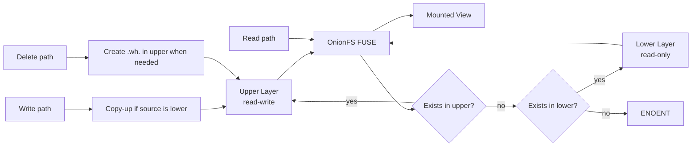

# OnionFS🧅

A userspace union filesystem built with FUSE in Go

## Requirements

- Linux
- FUSE support enabled on the host
- Go 1.26+

## Build

From repository root:

```bash
go build -o onionfs .
```

## Usage

```bash
./onionfs -l <lower_dir> -u <upper_dir> -m <mountpoint> [flags]
```
**Required:**

| Flag | Description |
|---|---|
| `-l`, `--lower` | lower (read-only) directory |
| `-u`, `--upper` | read-write layer directory |
| `-m`, `--mountpoint` | where the merged view is mounted |

**Optional:**

| Flag | Description |
|---|---|
| `--show-meta` | show internal `.wh.*` whiteout files in listings |
| `--version` | print version and exit |
| `-h`, `--help` | print help |

> Note: Currently all three paths must already exist otherwise OnionFS exits with an Error

## How It Works

### Architecture Diagram



### Path Resolution

Every operation starts by resolving the virtual path through these steps in order:

1. If `upper/.wh.<name>` exists, file is deleted, return `ENOENT`
2. If `upper/<path>` exists, serve from upper
3. If `lower/<path>` exists, serve from lower
4. Otherwise `ENOENT`

### Copy-on-Write (CoW)

When a lower-layer file is opened for `write` or modified via `setattr` paths, OnionFS copies it to upper first, then applies mutations to the upper copy.

### Delete and Whiteouts

Deleting through the mountpoint:

- removes upper copy if present
- creates `.wh.<name>` in upper when lower has the object

This hides the lower object from the merged view without deleting data from lower

### Directory Listings

- Merges entries from upper and lower
- Excludes whiteout targets
- Hides `.wh.*` files by default
- Shows `.wh.*` files in `ls -la` when `--show-meta` is set

## License

This project is open-source and available under the MIT License